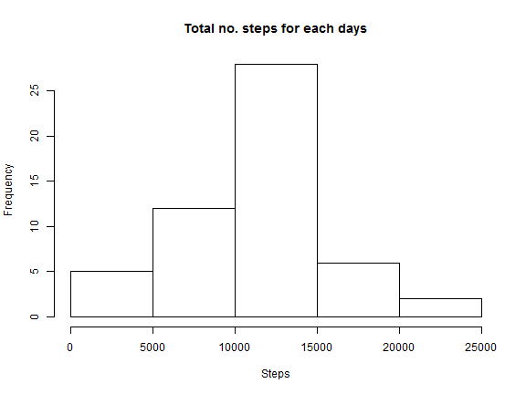
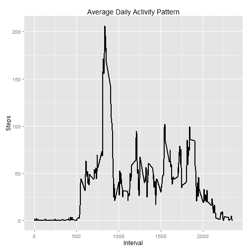
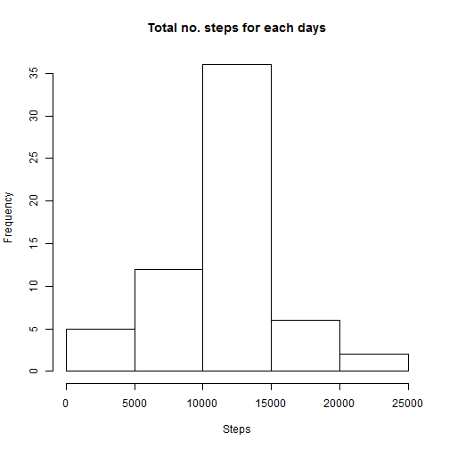
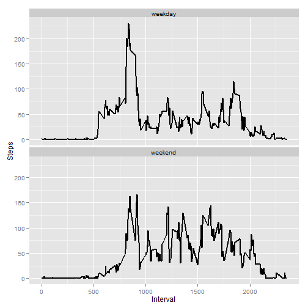

# Reproducible Research: Peer Assessment 1


## Loading and preprocessing the data:

-Load the data

```r
## Set Working directory
setwd("C:/RR1/");
## Load .csv file
activitiesFile <- read.csv("./activity.csv", na.strings = "NA", stringsAsFactors = FALSE)
```


## Mean total number of steps taken per day:

- Make a histogram of the total number of steps taken each day

```r
require(ggplot2)
```

```
## Loading required package: ggplot2
```

```r
require(plyr)
```

```
## Loading required package: plyr
```

```r
totalSteps <- ddply(activitiesFile, .(date), function(activitiesFile) sum(activitiesFile$steps))
names(totalSteps) <- c("Date", "Total Steps")
hist(totalSteps[["Total Steps"]], main = "Total no. steps for each days", xlab = "Steps")
```

 


- Calculate and report the mean and median total number of steps taken per day

```r
meanValue <- mean(totalSteps[["Total Steps"]], na.rm = TRUE)
medianValue <- median(totalSteps[["Total Steps"]], na.rm = TRUE)

print(meanValue)
```

```
## [1] 10766
```

Mean : 1.0766 &times; 10<sup>4</sup>      Median: 10765

## Average daily activity pattern:

- Time series plot of the 5-minute interval (x-axis) and the average number of steps taken, averaged across all days (y-axis)

```r
plotGraph <- function(dataSet) {
    # Initialize ggplot
    g <- ggplot(dataSet, aes(interval, steps))
    # Add layer
    g <- g + geom_line(size = 1)
    # Add label
    g <- g + labs(title = "Average Daily Activity Pattern", x = "Interval", 
        y = "Steps")
    
    print(g)
    
}
# Find the average steps for interval
avrStepPerInterval <- ddply(activitiesFile, .(interval), function(activitiesFile) mean(activitiesFile$steps, 
    na.rm = TRUE))
names(avrStepPerInterval) <- c("interval", "steps")
plotGraph(avrStepPerInterval)
```

 


- 5-minute interval, on average across all the days in the dataset, contains the maximum number of steps

```r
# Find interval in which maximum steps contained
maxStepInterval <- avrStepPerInterval[which.max(avrStepPerInterval$steps), ]$interval
```

Interval contains the maximum number of steps: 835


## Imputing missing values

- Calculate and report the total number of missing values in the dataset (i.e. the total number of rows with NAs)

```r
## Remove NA values
rowCount <- nrow(activitiesFile[is.na(activitiesFile$steps), ])
```

The total number of rows with NAs is 2304.


- Fill all of the missing values in the dataset with mean value of the interval

```r
meansValue <- function(activitiesFile, avrStepPerInterval) {
    naIndices <- which(is.na(activitiesFile$steps))
    replacements <- unlist(lapply(naIndices, FUN = function(x) {
        interval = activitiesFile[x, ]$interval
        temp <- round(avrStepPerInterval[which(avrStepPerInterval$interval == 
            interval), ]$steps, 2)
    }))
    missedSteps <- activitiesFile$steps
    missedSteps[naIndices] <- replacements
    missedSteps
}
## Data frame for fixed data
healedData <- data.frame(steps = meansValue(activitiesFile, avrStepPerInterval), 
    date = activitiesFile$date, interval = activitiesFile$interval)

oriSummary <- summary(activitiesFile)
filledDataSummary <- summary(healedData)
```

Summary of original data: Min.   :  0.0  , 1st Qu.:  0.0  , Median :  0.0  , Mean   : 37.4  , 3rd Qu.: 12.0  , Max.   :806.0  , NA's   :2304  , Length:17568      , Class :character  , Mode  :character  , NA, NA, NA, NA, Min.   :   0  , 1st Qu.: 589  , Median :1178  , Mean   :1178  , 3rd Qu.:1766  , Max.   :2355  , NA

Summary of filled data: Min.   :  0.0  , 1st Qu.:  0.0  , Median :  0.0  , Mean   : 37.4  , 3rd Qu.: 27.0  , Max.   :806.0  , NA, 2012-10-01:  288  , 2012-10-02:  288  , 2012-10-03:  288  , 2012-10-04:  288  , 2012-10-05:  288  , 2012-10-06:  288  , (Other)   :15840  , Min.   :   0  , 1st Qu.: 589  , Median :1178  , Mean   :1178  , 3rd Qu.:1766  , Max.   :2355  , NA


- Histogram of the steps taken each days

```r
steps <- ddply(healedData, .(date), function(healedData) sum(healedData$steps))
names(steps) <- c("Date", "Total Steps")
hist(steps[["Total Steps"]], main = "Total no. steps for each days", xlab = "Steps")
```

 

```r

mean <- round(mean(steps[["Total Steps"]], na.rm = TRUE), 2)
median <- round(median(steps[["Total Steps"]], na.rm = TRUE), 2)
```

Mean after fixing NA values : 1.0766 &times; 10<sup>4</sup>      
Median after fixing NA values: 1.0766 &times; 10<sup>4</sup>


## Activity patterns between weekdays and weekends

```r
evaluateWeeklyStep <- function(fixedData) {
    fixedData$weekday <- as.factor(weekdays(as.Date(fixedData$date)))
    weekend <- subset(fixedData, weekday %in% c("Saturday", "Sunday"))
    weekday <- subset(fixedData, !weekday %in% c("Saturday", "Sunday"))
    
    weekendSteps <- ddply(weekend, .(interval), function(weekend) mean(weekend$steps, 
        na.rm = TRUE))
    weekdaySteps <- ddply(weekday, .(interval), function(weekday) mean(weekday$steps, 
        na.rm = TRUE))
    
    weekendSteps$dayofweek <- rep("weekend", nrow(weekendSteps))
    weekdaySteps$dayofweek <- rep("weekday", nrow(weekdaySteps))
    
    week <- rbind(weekendSteps, weekdaySteps)
    week$dayofweek <- as.factor(week$dayofweek)
    names(week) <- c("interval", "steps", "dayofweek")
    week
}
weeklyPlot <- function(healedData) {
    ggplot(healedData, aes(interval, steps)) + geom_line(size = 1) + facet_wrap(~dayofweek, 
        nrow = 2, ncol = 1) + labs(x = "Interval", y = "Steps")
}
weekData <- evaluateWeeklyStep(healedData)
weeklyPlot(weekData)
```

 


